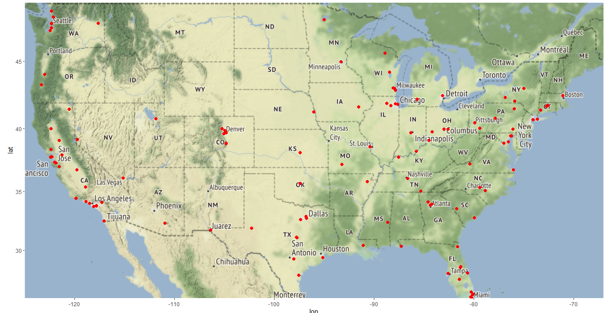
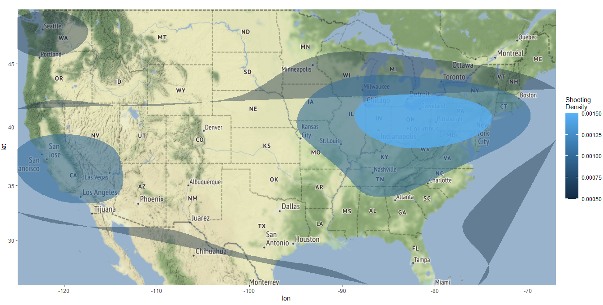

# Mass Shootings Data Visualization Project

## Overview
This project presents an in-depth analysis and visualization of mass shootings in the United States using the "Mother Jones - Mass Shootings Database, 1982 - 2021" dataset. The dataset provides detailed information on incidents involving multiple firearm-related victims, and this project aims to uncover trends, regional patterns, and other insights through various data visualization techniques.

## Dataset
The dataset used in this project is sourced from the "Mother Jones - Mass Shootings Database, 1982 - 2021," which contains a comprehensive list of mass shootings in the United States between 1924 and 2022. Each entry in the dataset includes relevant details such as the location, date, number of casualties, injuries, and a description of the incident.

### Key columns include:

- **Date**: Date of the shooting
- **City**: City where the shooting occurred
- **State**: State where the shooting occurred
- **Dead**: Number of casualties
- **Injured**: Number of people injured
- **Total**: Dead + Injured
- **Description**: Description of the shooting
  
## Objectives
The project uses this data to answer and explore key questions:

- What trends can be observed in mass shootings over the years?
- Which states and cities have the highest occurrences of mass shootings?
- What are the patterns when analyzing the relationship between the shooter's age and the number of victims?
- How do mental health issues factor into incidents of mass shootings?
- How can we visualize the geographical spread of mass shootings across the United States?
- What insights can be drawn from the textual descriptions of these shootings through word clouds?
  
## Visualizations
The project implements a series of visualizations to explore the data and derive meaningful insights:

### 1. Bar Plots:
Mass Shootings by Mental Health and Gender: A bar plot comparing the total number of victims based on the perpetrator's mental health status and gender.
Total Victims by Decade and Region: Analysis of how the number of victims has changed over time and across different regions.
### 2. Line Graph:
Fatalities Over Time by Region: A time-series visualization depicting the trend of fatalities across different U.S. regions, helping identify patterns over the years.
### 3. Scatter Plot with Regression Line:
Age vs. Total Victims: A scatter plot to assess whether there's a relationship between the age of the shooter and the total number of victims, accompanied by a linear regression line.
### 4. Clustering Analysis:
K-means Clustering of Incidents: An exploration of clustering patterns based on numeric variables such as age, fatalities, and total victims, to uncover hidden relationships within the data.
### 5. Word Cloud:
Word Cloud of Shooting Locations & Perpetrator Race: Visualization of the frequency of certain locations and racial demographics of perpetrators based on textual descriptions within the dataset.
### 6. Geographical Mapping:
Mass Shootings Across the U.S.: A geographical visualization using the ggmap package, marking incidents on a U.S. map with point sizes representing the number of victims.
Heatmap of Shootings: A heatmap visualizing the density of mass shootings across different parts of the United States, highlighting regions with the most frequent occurrences.

## Clustering & Analysis
To identify patterns among the data, we applied clustering techniques:

- **K-means clustering** was performed on the scaled dataset, using features such as age, number of fatalities, and total victims. The clustering helped in categorizing different types of mass shootings based on quantitative factors.

## Word Clouds
Textual data in the dataset, such as location and the perpetrator's race, were visualized using word clouds, providing insight into the most common locations and demographic patterns of perpetrators.

## Mapping and Geospatial Visualization
To further explore the geographical distribution of mass shootings, the dataset was visualized on U.S. maps:

- **Scatter Plot on U.S. Map**: Locations of mass shootings were plotted using latitude and longitude data, with the size of the points indicating the number of victims.
 
- **Density Heatmap**: A heatmap showed the concentration of mass shootings across different U.S. regions, offering a visual cue to identify high-risk areas.
 

## Technologies Used
The following libraries and tools were used in this project:

- **R Programming Language**
- **ggplot2** for data visualization
- **dplyr** for data manipulation
- **cluster** for clustering analysis
- **wordcloud2** for generating word clouds
- **ggmap** for map-based visualizations

## Summary
This project provides a comprehensive view of mass shootings in the U.S. and presents the data in various visual formats to assist with identifying trends, understanding patterns, and extracting actionable insights. By leveraging visualization techniques and clustering algorithms, the project aims to offer a nuanced understanding of this complex issue.

## How to Run
- Clone the repository.
- Load the dataset ("Mother Jones - Mass Shootings Database, 1982 - 2021") into your R environment.
- Run the R script to generate the visualizations and analyses.
